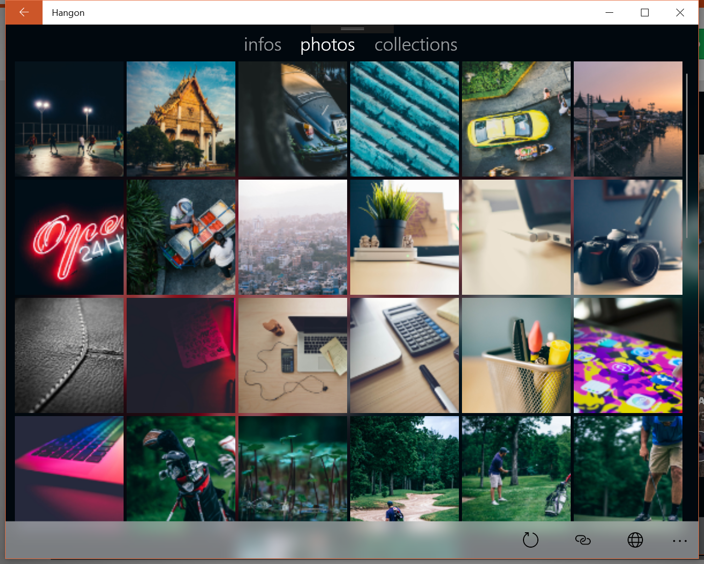

# Hangon
Minimalist wallpaper changer for Windows 10.

_Powered by [Unsplash](https://unsplash.com)_

<a href="https://www.microsoft.com/store/apps/9PF0GQ81HNDF?ocid=badge"></a>


## screenshots

### pc




### mobile


## features

* live tile showing recent photos
* change periodically wallpaper
* change periodically lockscreen
* browse new and featured photos
* search photos

## setup
Steps to build and run this project:

1. Clone or download this repository
2. (Optional) Unzip the archive to your favorite location if needed (not needed if you run the git command ```git clone https://github.com/rootasjey/Hangon.git```)
3. Navigate to the ```Hangon/``` folder
4. Open ```Hangon.sln``` in [Visual Studio](https://www.visualstudio.com/thank-you-downloading-visual-studio/?sku=Community&rel=15)
5. Choose your favorite platform and click on Run :)

## contributing

You can contribute to improve this project by:

* edit the code
* create a pull request
* submit new ideas / features suggestions
* report a bug

## platforms

* Windows Mobile 10
* Windows 10
* Xbox
* Hololens

## personal API key

In this project, a test API key is used which is limited to 50 requests per hour. So ensure you're not off limit.

If you want to get your personal API key from Unsplash:

1. Go to [Unsplash](https://unsplash.com)
2. Log in or create a new account
3. In the top bar, click on _'API/Developers'_
4. Go to _['Your applications'](https://unsplash.com/oauth/applications)_
5. Click on _'New Application'_ to create a new one and get an API key (and a Secret).

## todos

* zoom on photos
* donations
* slideshow
